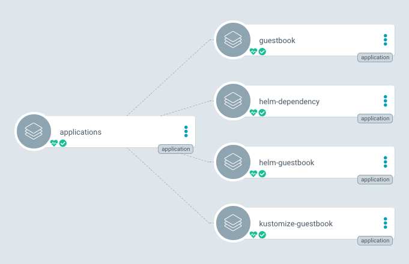
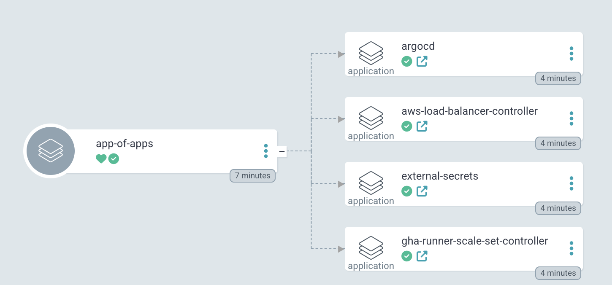

This arcticle describes a practical implementation of the app of apps pattern using argocd with a real-world example using helm templating.
This pattern in argocd allows to create a single application (let's call it *app-of-apps* for convenience) that contains all the other applications that we want to deploy in the cluster.
This is specially useful when we want to bootstrap a cluster and want argocd to take care of deploying all the applications in the cluster.
In this scenario we only deploy the *app-of-apps* application, and, as this application contains all the other applications as child apps, argocd will take care of deploying yhem.

This pattern is described in argocd documentation: https://argo-cd.readthedocs.io/en/stable/operator-manual/cluster-bootstrapping/

Being practical, there are several cluster apps that we need when creating a cluster, like monitoring, logging, ingress, controllers, etc.
Being specific now, things like *aws-load-balancer-controller*, *kube-prometheus-stack*, *external-secrets*, etc.
As we don't want to deploy all these applications manually, we can use the app of apps pattern to deploy them all at once.

Now that we have a general idea of purpose of the app of apps pattern, in this post we will try to make it easier using helm templating.
Let's go over on how to use helm charts and common manifests with argocd, and then how to use it in the app of apps pattern automating the argocd app generation with helm.

In the first two parts I'll just go over the docs, so nothing new, but in the last part I'll show how to use helm to generate the app of apps project in an automated way.

### Deploying external helm charts with argocd
Usually we want to deploy external applications using helm charts, for instance, if we want to deploy an operator we just want to specify the chart we want to use and the values.yaml.
In argocd we can treat these applications as dependencies and create a helm project specifying the helm chart repository and the values.yaml.

The argocd has a good example for this and we will use it to explain this part: https://github.com/argoproj/argocd-example-apps/tree/master/helm-dependency.

So, we create a folder project with the following structure:

```bash
├── Chart.yaml
└── values.yaml
```

In the *Chart.yaml* we specify the helm chart repository and the chart name:

```yaml
apiVersion: v2
name: wordpress
description: A Helm chart for Kubernetes

# A chart can be either an 'application' or a 'library' chart.
#
# Application charts are a collection of templates that can be packaged into versioned archives
# to be deployed.
#
# Library charts provide useful utilities or functions for the chart developer. They're included as
# a dependency of application charts to inject those utilities and functions into the rendering
# pipeline. Library charts do not define any templates and therefore cannot be deployed.
type: application

# This is the chart version. This version number should be incremented each time you make changes
# to the chart and its templates, including the app version.
# Versions are expected to follow Semantic Versioning (https://semver.org/)
version: 0.1.0

# This is the version number of the application being deployed. This version number should be
# incremented each time you make changes to the application. Versions are not expected to
# follow Semantic Versioning. They should reflect the version the application is using.
appVersion: "1.0"

dependencies:
- name: wordpress
  version: 9.0.3
  repository: https://charts.helm.sh/stable
```

The only part you need to change is the *dependencies* section, where you specify the chart name (this is the name of the chart in the repository), version of the chart and repository.
In the *values.yaml* you specify the values you want to override in the chart. Usually you get the values from the chart documentation and change them as you need.
One thing you need to pay attention in the *values.yaml* is that you should start the yaml file with the name of the chart you are using, like this:

```yaml
wordpress:
  wordpressPassword: foo
  mariadb:
    db:
      password: bar
    rootUser:
      password: baz
```

So you take the regular values from the documentation but they need to be inside the chart name key. Like here we have the values inside the *wordpress* key because the chart name is *wordpress*.

Having this structure you could create the application in argocd: 

```yaml

apiVersion: argoproj.io/v1alpha1
kind: Application
metadata:
  name: wordpress
  namespace: argocd
  finalizers:
spec:
  project: default
  source:
    repoURL: https://github.com/argoproj/argocd-example-apps
    path: helm-dependency
    targetRevision: HEAD
    helm:
      valueFiles:
        - values.yaml
  destination:
    server: https://kubernetes.default.svc
    namespace: wordpress
  syncPolicy:
    automated:
      prune: true
      selfHeal: true
    syncOptions:
      - CreateNamespace=true
```

Deploying this manifest would make argocd deploy the wordpress application in the wordpress namespace with the values specified in the *values.yaml*.

### Deploying common manifests with argocd
For this part we will also rely on the good example from the argocd documentation: https://github.com/argoproj/argocd-example-apps/tree/master/guestbook.
In this example we see two common manifest files being used. To deploy this we would simply create this argocd application:

```yaml
apiVersion: argoproj.io/v1alpha1
kind: Application
metadata:
  name: helm-guestbook
  namespace: argocd
  finalizers:
  - resources-finalizer.argocd.argoproj.io
spec:
  destination:
    namespace: helm-guestbook
    server: https://kubernetes.default.svc
  project: default
  source:
    path: helm-guestbook
    repoURL: https://github.com/argoproj/argocd-example-apps
    targetRevision: HEAD
```

This would deploy the guestbook application in the helm-guestbook namespace.

### Using helm to generate the app of apps project

Now that we know how to deploy helm charts and common manifests with argocd, let's understand the proposed solution from the argocd documentation to use the app of apps pattern.

This is the example from the same repository: https://github.com/argoproj/argocd-example-apps/tree/master/apps

If you see the *templates* folder, we define several argocd applications, and this could be whatever we need to deploy in the cluster.

```yaml
├── Chart.yaml
├── templates
│   ├── guestbook.yaml
│   ├── helm-dependency.yaml
│   ├── helm-guestbook.yaml
│   ├── kustomize-guestbook.yaml
│   └── WHATEVER_WE_NEED_TO_DEPLOY.yaml
└── values.yaml
```

The *Chart.yaml* is just boilerplate and the *values.yaml* would hold whatever values we need to override in the applications. So far so good.
To deploy this structure we would create the argocd application like this:

```yaml
apiVersion: argoproj.io/v1alpha1
kind: Application
metadata:
  name: applications
  namespace: argocd
  finalizers:
    - resources-finalizer.argocd.argoproj.io
spec:
  destination:
    namespace: argocd
    server: 'https://kubernetes.default.svc'
  source:
    path: apps
    repoURL: https://github.com/argoproj/argocd-example-apps
    targetRevision: HEAD
  project: default
  syncPolicy:
    automated:
      prune: true
      selfHeal: true
    syncOptions:
      - CreateNamespace=true
```

Deploying this would create the *app-of-apps* that would contain all the applications defined in the *templates* folder.



This is a good solution, but it's not automated. Every time we need a new application we need to add it to the *templates* folder.
Another point is that if you take a look in the *templates* folder, almost all the applications are the same, they just have different values.
So, we could rely on helm templating to generate the applications in the *templates* folder automatically.

This is the solution I like to use: https://github.com/caiocsgomes/aws-eks-cluster/tree/main/kubernetes

This is my *app-of-apps* project:

```yaml
apiVersion: argoproj.io/v1alpha1
kind: Application
metadata:
  name: app-of-apps
  namespace: argocd
  finalizers:
    - resources-finalizer.argocd.argoproj.io
spec:
  destination:
    namespace: argocd
    server: 'https://kubernetes.default.svc'
  source:
    path: kubernetes/app-of-apps
    repoURL: https://github.com/caiocsgomes/aws-eks-cluster
    targetRevision: HEAD
  project: default
  syncPolicy:
    automated:
      prune: true
      selfHeal: true
    syncOptions:
      - CreateNamespace=true
```

This pretty much never changes, as it is just creating the app pointing to the *kubernetes/app-of-apps* folder in my repository.
Then on the *kubernetes/app-of-apps* folder I have the following structure:

```yaml
├── Chart.yaml
├── templates
│   ├── template-helm.yaml
│   └── template-manifests.yaml
└── values.yaml
```

The main difference here is I don't use the *templates* folder to store applications, I use it to store the helm templates that will generate the applications for me.
As these templates are based on the *values.yaml* file I can add new applications just by adding new values to the file.

As an example, this is my current template for helm (https://github.com/caiocsgomes/aws-eks-cluster/blob/main/kubernetes/app-of-apps/templates/template-helm.yaml):

```yaml
{{- range $chart := .Values.charts }}
apiVersion: argoproj.io/v1alpha1
kind: Application
metadata:
  name: {{ $chart.name }}
  namespace: argocd
  finalizers:
    - resources-finalizer.argocd.argoproj.io
  annotations:
    argocd.argoproj.io/sync-options: Prune=true
    argocd.argoproj.io/sync-wave: "{{ $chart.sync_wave | default 0 | toString }}"
spec:
  project: default
  source:
    repoURL: {{ $.Values.github_repo }}
    path: {{ $.Values.base_path }}/{{ $chart.name }}
    targetRevision: HEAD
    helm:
      valueFiles:
        - values.yaml
  destination:
    server: {{ $.Values.destination.server }}
    namespace: {{ $chart.name }}
  syncPolicy:
    automated:
      prune: true
      selfHeal: true
    syncOptions:
      - CreateNamespace=true
      - ServerSideApply=true
---
{{- end }}
```

See that the application and the code used in the application is generated based on the *values.yaml* file.
So in the values file I can just add new applications and they will be generated automatically.

This is the current *values.yaml* file:

```yaml
github_repo: https://github.com/caiocsgomes/aws-eks-cluster
base_path: kubernetes
destination:
  server: https://kubernetes.default.svc
charts:
- name: aws-load-balancer-controller
  sync_wave: "-1"
- name: gha-runner-scale-set-controller
- name: external-secrets
  sync_wave: "-1"
manifests:
- name: argocd
```

So I'll have these applications inside the *app-of-apps* application in argocd.

 

The manifests or helm charts that I need to deploy are specified in the *kubernetes* folder as we saw in the previous examples.
So, whenever I need to add a new app, I create it in the *kubernetes* folder and add it to the *app-of-apps* *values.yaml* file.
This way I almost never need to change the *app-of-apps* application, I just need to add new applications to the *values.yaml* file.!-- Paragraphs and headers (if necessary) -->
