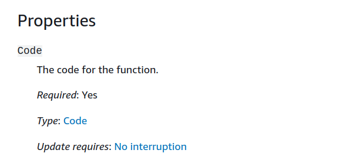
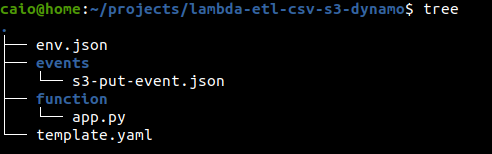
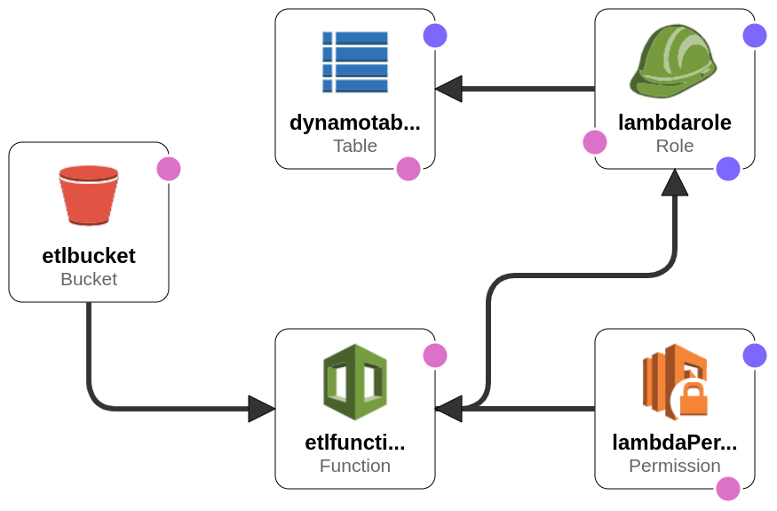

Recently I had to convert a csv into a dynamodb table and my first thought was having a S3 bucket that would trigger an event for a lambda function when
a file was uploaded to it. The lambda function would extract the csv data and load it into a dynamodb table. As this is a common scenario I decided
to use IAAS with cloudformation, this way I would have a file that would create all the resources with all the configurations needed if I encountered
the problem again.

When I was almost finishing the cloudformation template I realized that I had to place the lambda code on the template as well, since the code section
for the cloudformation [lambda resource](https://docs.aws.amazon.com/AWSCloudFormation/latest/UserGuide/aws-resource-lambda-function.html) is required.

So if I used cloudformation I would have infrastructure code and application code on the same file. Boy, this is a mess. I don't get why the section
cannot point to a git repository link. So I stopped at this point and looked for another solution, then I found aws
[SAM](https://aws.amazon.com/serverless/sam/) (serverless application model).

SAM is a framework to build serverless applications. Using SAM I could split my infrastructure template from my lambda template and one of the coolest
things is SAM is an extension of cloudformation, so if you as me is used to building cloudformation templates, you kind of already know SAM. The only things
you have to learn is its CLI, used to manage the project and its structure. Another nice feature is testing the lambda function locally with the SAM CLI.

For the structure you have the *env.json* that has the environment variables, the event files in the *events*
folder, that contains the events to test your lambda function locally, the *app.py* for you application code and the
*template.yml* that contains the infrastructure code. The source code with instructions is available on my [github page](https://github.com/caiocsgomes/lambda-etl-csv-s3-dynamo).

The image is provided by the cloudformation designer with the *template.yml* code. By the image we see that S3 invokes the
lambda function that inserts data on the dynamodb table. But besides that we see two other components, the *lambda permition*
and the *lambda role*. We need the lambda permission to designate who can invoke the lambda function. So in the lambda permission
we allow the S3 bucket to invoke lambda function. Furthermore we need a role to allow the lambda function to insert data on the dynamo table. So we create
a policy, that is a document describing what an identity can do, associate the policy to the role and associate the role to the lambda function.
