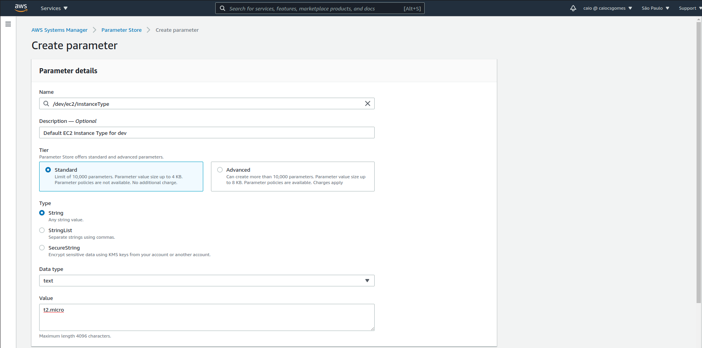
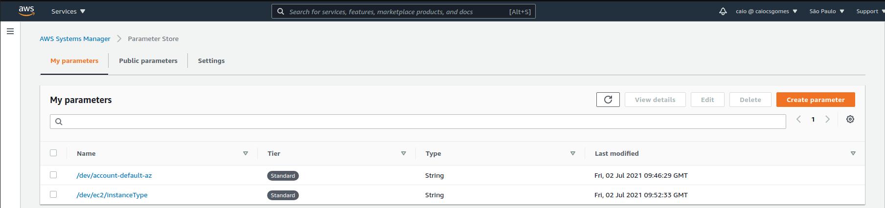
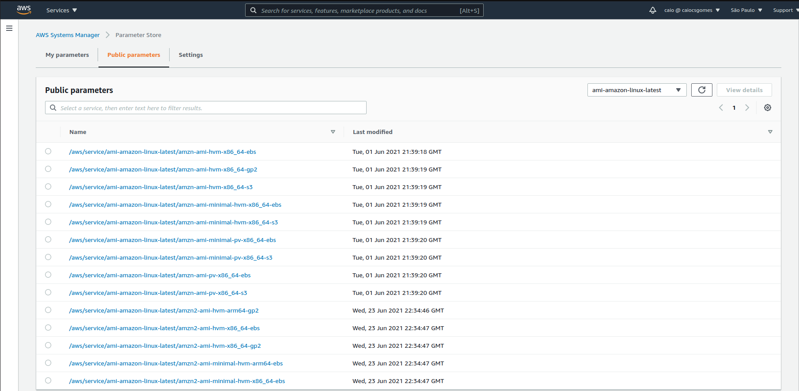

[Parameter Store](https://docs.aws.amazon.com/systems-manager/latest/userguide/systems-manager-parameter-store.html) is a 
capability from AWS Systems Manager used to store configuration data and secrets in a easy way. 
It can be used as a good approach to separate data from code. One of the benefits from the Parameter Store is the 
possibility of referencing it from a CloudFormation template, so you can store your configuration data in Parameter Store 
and reference it as a parameter in CloudFormation.

A parameter can be created on the console on *Systems Manager -> Parameter Store -> Create a Parameter*.

 

Any type of useful configuration data or secret can be create on the Parameter Store.



Another useful Parameters available are the [public parameters](https://docs.aws.amazon.com/systems-manager/latest/userguide/parameter-store-finding-public-parameters.html). These parameters belong to AWS and can be used to find the latest image IDs for 
example, and for a lot of useful data on AWS resources that are contantly being updated. As image IDs for EC2s change from region to region and are 
updated from time to time it is not a best approach to hard-code it on the template.



With the values available in the parameter store we can just reference them on the <span class="italic">template</span>.

```yml
    Parameters:
        MyDefaultAZ:
            Type: AWS::SSM::Parameter::Value<String>
            Description: Default AZ for account
            Default: /dev/account-default-az
        
        MyDevInstanceType:
            Type: AWS::SSM::Parameter::Value<String>
            Description: Default EC2 instance type for dev
            Default: /dev/ec2/instanceType
        
        MyDevImageId:
            Type: AWS::SSM::Parameter::Value<AWS::EC2::Image::Id>
            Description: Default Dev ImageId
            Default: /aws/service/ami-amazon-linux-latest/amzn-ami-hvm-x86_64-ebs
    
    Resources:
        MyEC2:
            Type: AWS::EC2::Instance
            Properties:
            AvailabilityZone: !Ref MyDefaultAZ
            InstanceType: !Ref MyDevInstanceType
            ImageId: !Ref MyDevImageId
```

One thing to notice are the SSM parameters type, AWS has a nice [documentation](https://docs.aws.amazon.com/AWSCloudFormation/latest/UserGuide/parameters-section-structure.html#aws-ssm-parameter-types) explaining which types are supported.
