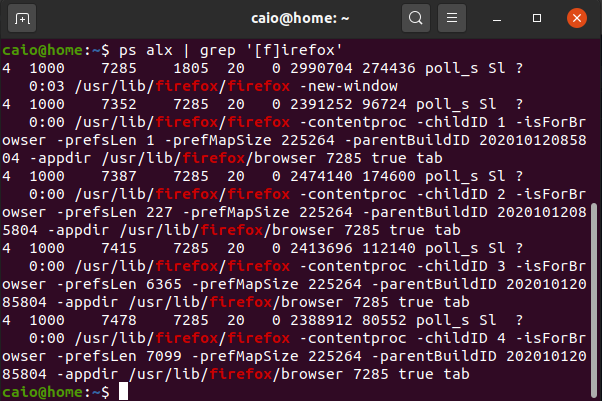

One of the major concepts that people miss when studying docker are processes. While a lot of people try to
understand the difference between a container and a VM, a much more
interesting question is what is the difference between a container and a process. To understand that first
you need to learn what a process is, and that's what we are going to do
on this post.      

Think about a regular day using a computer. You probably open several programs and just
forget about what the computer is doing. Under the hoods, the computer is starting a new process for each
program you start. That program itself can start other processes. Lets think about a browser, when you click on the
firefox icon it sends a system call to the linux kernel that will initiate the chrome program. The command will start a new process and
this is why the usual definition of a process is *a program in execution*.
This firefox process can or cannot start new processes that can initiate new processes by themselves,
forming a tree of processes. Let's see how this works in a practical manner on the
shell.

Formatting the data to a human readable table we have the following:

|      PID      |      PPID     |                       Command                       |
| ------------- | ------------- | --------------------------------------------------- |
|     7285      |      1805     | usr/lib/firefox/firefox -new-window                 |
|     7352      |      7285     | /usr/lib/firefox/firefox -contentproc -childID 1... |
|     7387      |      7285     | /usr/lib/firefox/firefox -contentproc -childID 2... |
|     7387      |      7285     | /usr/lib/firefox/firefox -contentproc -childID 3... |
|     7415      |      7285     | /usr/lib/firefox/firefox -contentproc -childID 4... |
|     7478      |      7285     | /usr/lib/firefox/firefox -contentproc -childID 5... |

*PID* is the process ID, *PPID* is the parent process ID and *Command* is the command that launched the process. If you run the first
command on Linux it will open Firefox and as you can see this process started several other process as its ID
(7285) is the parent ID of the other processes. The parent process creates a child process
by making an exact copy of itself in memory. After making this copy, the child has the same environment as its
parent and can change itself. Now that we know how a process starts we have to understand what problem it is trying to solve.

Coming back at a regular usage for a computer. Even though you start several programs on a given
day, you have just one CPU, and it is
capable of executing one task at a time. So the kernel manages what process is being executed at a given
time
and puts the other ones on hold. But if
a given process is kept on hold while another task is being executed, how does the kernel know where it left
off when it comes back? A process is
not only a CPU execution, it also has
its own space memory associated. So this is the problem processes are trying to solve: handle several tasks
with
limited resources by creating executing units
and giving them the resources needed.